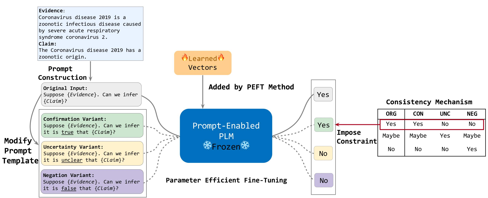

# Prompt to be Consistent is Better than Self-Consistent? Few-Shot and Zero-Shot Fact Verification with Pre-trained Language Models (Accepted as Findings of ACL 2023) 

This is the official repository of Few-Shot and Zero-Shot Fact Verification model ProToCo. 

- ProToCo is a novel prompt-based consistency training method for improving PLMs on few-shot and zero-shot fact verification by explicitly imposing a general factuality-grounded consistency scheme on PLMs.


<p align="center">

</p>


## Requirements

Our code is developed based on the [T-Few](https://github.com/r-three/t-few) codebase. Plese refer to the T-Few repo for setup instruction.

## The format of input data
Please ensure that the train and test data files are in JSONL format, with the following fields for each line::
 ```
 {"id": instance id, "gold_evidence_text": gold evidence text, "claim":claim text, "label": label}
 ```
You may also download the processed files from this [link](https://drive.google.com/drive/folders/1DWcudOUX4OADBp0lryIQLIINwvpqzy6o?usp=sharing).

## Training & Evaluation

To train ProToCo with default hyperparameters, run the following command for few-shot setting:
```
sh train_fs.sh
```
run the following command for zero-shot setting:
```
sh train_zs.sh
```
After training, the script will automatically output the test results. You can also customize the hyperparameters and data directory in the default.json file to train your custom dataset with specific hyperparameters. If you set the *eval_before_training* parameter in default.json to true and *num_steps* to 0, you can use the same command to test the trained model without training.

## Citation

If you use this code in your research, please cite our [paper](https://arxiv.org/abs/2306.02569).

```
@inproceedings{zeng-gao-2023-prompt,
    title = "Prompt to be Consistent is Better than Self-Consistent? Few-Shot and Zero-Shot Fact Verification with Pre-trained Language Models",
    author = "Zeng, Fengzhu  and
      Gao, Wei",
    booktitle = "Findings of the Association for Computational Linguistics: ACL 2023",
    month = jul,
    year = "2023",
    address = "Toronto, Canada",
    publisher = "Association for Computational Linguistics",
    url = "https://aclanthology.org/2023.findings-acl.278",
    pages = "4555--4569"
}
```

## Contact for issues
- Fengzhu Zeng, fzzeng.2020@phdcs.smu.edu.sg

## References & Open sources

- **T-Few** : [[paper]](https://openreview.net/forum?id=rBCvMG-JsPd)[[code]](https://github.com/r-three/t-few)
- **T0** : [[paper]](https://openreview.net/forum?id=9Vrb9D0WI4), [[code]](https://github.com/bigscience-workshop/t-zero)
- **OPT** : [[paper]](https://arxiv.org/abs/2205.01068), [[code]](https://huggingface.co/docs/transformers/model_doc/opt)
- **GPT2-PPL** : [[paper]](https://aclanthology.org/2021.naacl-main.158.pdf), [[code]](https://github.com/HLTCHKUST/Perplexity-FactChecking)
- **RoBERTa-L** : [[paper]](https://arxiv.org/abs/1907.11692)
- **SEED** : [[paper]](https://www.ncbi.nlm.nih.gov/pmc/articles/PMC9680879/)
- **FEVER dataset** : [[paper]](https://aclanthology.org/N18-1074/)
- **SciFACT dataset** : [[paper]](https://aclanthology.org/2020.emnlp-main.609/)
- **VitaminC dataset** : [[paper]](https://aclanthology.org/2021.naacl-main.52/)
